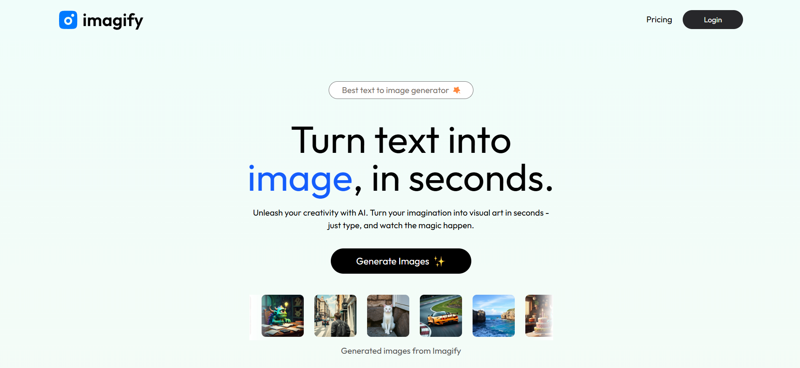

# 🖼️ Imagify – AI Image Generator

**Imagify** is a modern SaaS image generation app built using the MERN stack and powered by ClipDrop's AI API. Create stunning visuals by just typing a prompt.

---

## 🔗 Live Demo

👉 [Website Link](https://imagify-now.netlify.app)

---

## 📸 Preview



---

## 📌 Table of Contents

- [🚀 Features](#-features)
- [🛠️ Tech Stack](#-tech-stack)
- [📦 Installation](#-installation)
- [📌 Usage](#-usage)
- [📂 Folder Structure](#-folder-structure)
- [🎯 Future Improvements](#-future-improvements)
- [🤝 Contributing](#-contributing)
- [📞 Contact](#-contact)

---

## 🚀 Features

- ✅ AI-based image generation via [ClipDrop API](https://clipdrop.co/apis)
- ✅ User authentication (JWT)
- ✅ Mobile-first responsive UI with Tailwind
- ✅ Full MERN stack implementation

---

## 🛠️ Tech Stack

| Frontend     | Backend           | Database | API      |
| :----------- | :---------------- | :------- | :------- |
| React + Vite | Node.js + Express | MongoDB  | ClipDrop |

---

## 📦 Installation

1.  **Clone the repository**
    ```bash
    git clone https://github.com/CoderGuyShubham/Imagify.git
    cd Imagify
    ```
2.  **Setup the server**
    ```bash
    cd server
    npm install
    ```
    Then run the server:
    ```bash
    npm start
    ```
3.  **Setup the client**
    ```bash
    cd ../client
    npm install
    ```
    Then run the client:
    ```bash
    npm run dev
    ```

---

## 📌 Usage

1.  Open the application in your browser.
2.  Register or log in with your credentials.
3.  In the prompt input field, describe the image you want to generate.
4.  Click **Generate** to create the image using the ClipDrop API.
5.  View the generated image on-screen.
6.  Download the image or continue generating more\!

---

## 📂 Folder Structure

```bash
Imagify/
├── client/          # React + Vite Frontend
├── server/          # Express Backend
├── assets/          # Images
├── README.md
└── ...
```

---

## 🎯 Future Improvements

- 🔐 Google/GitHub OAuth login
- 💾 Save & manage previous generations
- 🖼️ Image gallery with filters
- 🧪 Loading states & error feedback
- 📦 Docker support
- 📱 Convert to PWA (Progressive Web App)

---

## 🤝 Contributing

1.  Fork this repository
2.  Create a new branch: `git checkout -b feature/your-feature`
3.  Commit your changes: `git commit -m 'Add new feature'`
4.  Push to the branch: `git push origin feature/your-feature`
5.  Open a Pull Request

---

## 📞 Contact

Created by Shubham Singh – **@CoderGuyShubham**

For collaboration or feedback, open an issue or drop a message on GitHub.

⭐ If you like this project, consider giving it a star — it helps others discover it!
